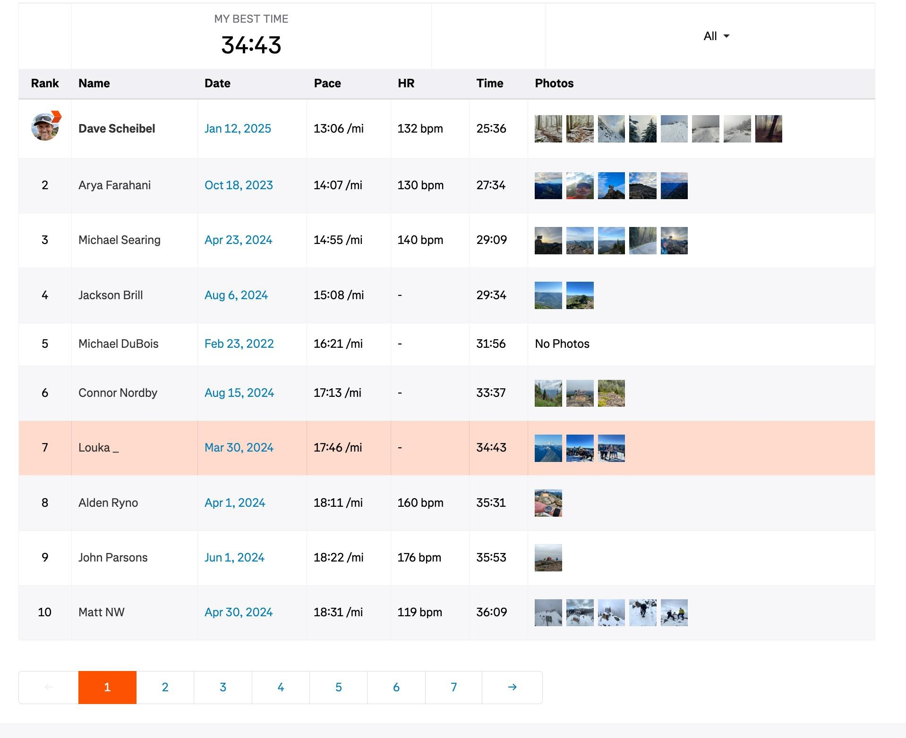

This Chrome extension adds a Photos column to the Strava segment leaderboard page showing any photos from each best effort's activity.

## Installation Instructions

1. Download the .CRX file from the [Releases page](https://github.com/loukad/strava-segment-photos/releases).
1. In your Chrome browser, go to Window > Extensions.
1. Drag and drop the .CRX file into the browser window.